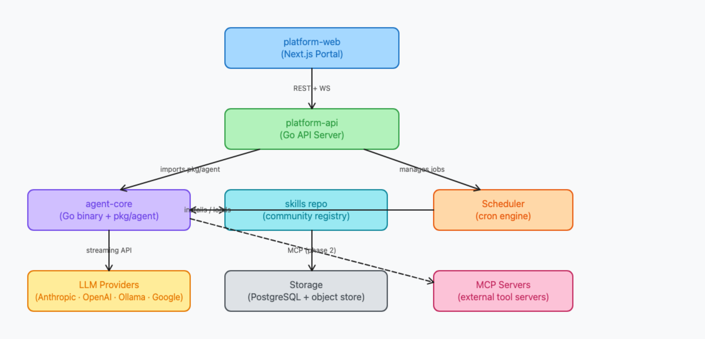
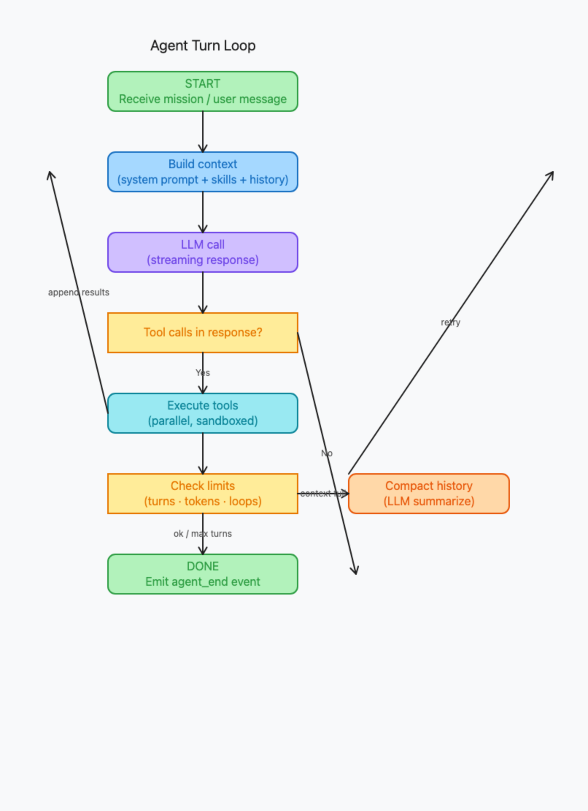

# Agent Platform

An AI agent platform for building, running, and managing autonomous AI agents. Create agents with custom personas and skills, run them from the CLI or browser, stream output in real time, and manage everything through a web portal.

> **Status**: Feature-complete. All 12 phases done (0–9 + WASM sandbox + Credentials + AI Teams + CI/CD). ~180 source files, 190+ tests, 5 repos on GitHub.

---

## Repositories

| Repository | Language | Description | Status |
|---|---|---|---|
| [**agent-core**](https://github.com/bitop-dev/agent-core) | Go | Standalone CLI binary + `pkg/agent` library | ✅ 88 files, 14K lines, 171 tests |
| [**agent-platform-api**](https://github.com/bitop-dev/agent-platform-api) | Go | REST API server (Fiber, sqlc, 70 endpoints) | ✅ 48 files, 10K lines, 22 tests |
| [**agent-platform-web**](https://github.com/bitop-dev/agent-platform-web) | TypeScript | React + Vite + shadcn/ui web portal | ✅ 38 files, 16 pages |
| [**agent-platform-skills**](https://github.com/bitop-dev/agent-platform-skills) | Go → WASM | Community skill registry (git-native) | ✅ 10 skills (4 WASM + 6 instruction) |
| [**agent-platform-docs**](https://github.com/bitop-dev/agent-platform-docs) (this repo) | Markdown | Architecture, design docs, diagrams | ✅ Comprehensive |

---

## Architecture



```
┌─────────────────────────────────────────────────────────────┐
│          platform-web (React + Vite + shadcn/ui)            │
│    Dashboard · Agents · Runs · AI Teams · Skills · Schedules│
│    Credentials · Audit Log · API Keys · OAuth Login         │
└────────────────────────────┬────────────────────────────────┘
                             │ REST + WebSocket
┌────────────────────────────▼────────────────────────────────┐
│                platform-api (Go/Fiber)                      │
│  JWT + OAuth · 70 endpoints · RBAC · Audit (21 actions)     │
│  WebSocket Hub · Registry Sync · Scheduler · Prometheus     │
└──────┬────────────────────────────┬─────────────────────────┘
       │ imports pkg/agent          │ syncs registry.json
┌──────▼──────────────┐    ┌───────▼──────────────────┐
│    agent-core       │    │   Skill Sources (GitHub)  │
│    (Go binary)      │    │                           │
│                     │    │  bitop-dev/skills (default)│
│  · 3 LLM providers  │    │  mycorp/skills (custom)   │
│  · 9 core tools     │    │  anyone/skills (community)│
│  · WASM sandbox     │    └───────────────────────────┘
│  · Container sandbox│
│  · MCP client       │
│  · Context mgmt     │
└─────────────────────┘
```

### Tool Execution Model


```
Tool Executor
├── native      — 9 built-in Go tools (bash, read_file, agent_spawn, etc.)
├── wasm        — .wasm modules via Wazero (skill tools, zero deps)
├── container   — Docker/Podman OCI containers (full OS isolation)
└── mcp         — MCP server protocol (external tool servers)
```

### WASM Sandbox


All community skill tools are compiled to **WebAssembly** and run inside Wazero's sandbox:
- **Zero external dependencies** — no Python, no pip, no CLI tools
- **Capability-based security** — tools only access granted filesystem paths and network hosts
- **Host functions** — `http_request` and `http_request_headers` provide HTTP to WASM modules
- **Module caching** — SHA-256 content hash, ~530ms first call, ~3ms cached (160× speedup)
- **Portable** — `.wasm` runs on any OS/arch where agent-core runs

### Container Sandbox

For full OS-level isolation, skills can run inside Docker/Podman containers:
- Read-only root filesystem, no privilege escalation
- Memory + CPU limits, network disabled by default
- Ephemeral — container destroyed after each call (~123ms per call)
- Auto-detects Docker or Podman

---

## What's Built

### agent-core ✅

Standalone CLI binary that runs AI agents with tool calling, sandboxed skills, and safety features.

- **3 LLM providers**: OpenAI Chat Completions, Anthropic Messages, OpenAI Responses (+ Ollama)
- **9 core tools**: `bash` (opt-out), `read_file`, `write_file`, `edit_file`, `list_dir`, `grep`, `http_fetch`, `tasks`, `agent_spawn`
- **WASM sandbox**: Wazero runtime, HTTP host functions (basic + with headers), capability-based security
- **Container sandbox**: Docker/Podman, read-only root, memory/CPU limits, network isolation
- **11 example configs**: minimal, native tools, WASM skills, container, mixed-runtime, orchestrator, MCP, Ollama
- **Skill system**: install from GitHub registries, auto-fetch on run, WASM + container dispatch
- **MCP support**: stdio + HTTP/SSE transports for external tool servers
- **ReliableProvider**: 3-level failover, exponential backoff, API key rotation
- **Context compaction**: proactive + reactive LLM-summarize
- **Safety**: loop detection (3 strategies), credential scrubbing, approval manager, heartbeat
- **`pkg/agent` public API**: Builder pattern, QuickRun, sandbox registry
- **`pkg/hostcall`**: WASM guest bindings (`//go:wasmimport`) for tool authors

### agent-platform-api ✅

Go REST API server wrapping agent-core with persistence, auth, and real-time streaming.

- **70 REST endpoints** with JWT auth, OAuth (GitHub + Google), rate limiting, request IDs
- **Run execution**: async goroutine pool, WASM-sandboxed skill tools, WebSocket live streaming
- **AI Teams (Workflows)**: multi-agent DAG pipelines, dependency resolution, template variable substitution
- **Skill credentials**: per-user encrypted secrets (GITHUB_TOKEN, etc.) auto-injected into sandbox EnvVars
- **Scheduling**: cron/interval/one-shot with overlap policies (skip, queue, parallel)
- **Teams**: RBAC (owner/admin/member/viewer), invitations, team-scoped agents/runs
- **Audit logging**: 21 action types across all state-changing operations
- **API key management**: AES-256-GCM encryption at rest
- **CI/CD**: GitHub Actions (build, test, vet, lint, sqlc check, Docker build)
- **Observability**: `/health`, `/readyz`, `/metrics` (Prometheus text format)
- **Graceful shutdown**: drain scheduler → drain runner → close DB → shutdown server
- **Docker**: multi-stage build, non-root user, healthcheck

### agent-platform-web ✅

React SPA with "AgentOps Command Center" industrial theme.

- **16 pages**: dashboard, agents (list/detail/new/edit), runs (list/detail), AI Teams (workflows), skills, teams, schedules, credentials, audit log, API keys, login, register
- **Industrial design**: dark charcoal + amber/gold, LED indicators, scan-line overlays, JetBrains Mono
- **OAuth**: GitHub + Google buttons, avatar display in sidebar
- **Live streaming**: WebSocket run output with collapsed event timeline
- **Team management**: create teams, invite members, assign agents to teams
- **Docker**: multi-stage Bun→nginx build, SPA routing, API/WS proxy

### agent-platform-skills ✅

Git-native community skill registry with WASM-sandboxed tools.

**Tool skills (WASM):**
| Skill | Description | Network |
|---|---|---|
| 🔍 `web_search` | DuckDuckGo search | `html.duckduckgo.com` |
| 🌐 `web_fetch` | Fetch URL → readable content | Target host |
| 🐙 `github` | GitHub issues & PRs (2 tools) | `api.github.com` |
| 💬 `slack_notify` | Slack webhook POST | `hooks.slack.com` |

**Instruction-only skills:** `summarize`, `report`, `code_review`, `data_extract`, `write_doc`, `debug_assist`

---

## Quick Start

### Option A: Standalone CLI

```bash
cd agent-core && go build -o bin/agent-core ./cmd/agent-core/
export OPENAI_API_KEY=sk-...

# Simplest possible run — no skills
./bin/agent-core run -c examples/minimal-agent.yaml \
  --mission "Explain goroutines in 3 sentences"

# With WASM-sandboxed web search
./bin/agent-core skill install web_search
./bin/agent-core run -c examples/research-agent.yaml \
  --mission "What are the major changes in Go 1.24?"

# Interactive chat with all 9 built-in tools
./bin/agent-core chat -c examples/native-tools-agent.yaml
```

### Option B: Full Platform (Docker)

```bash
cp .env.example .env
# Edit .env with your JWT_SECRET and optionally OAuth credentials
docker compose up --build
# Open http://localhost:3002
```

### Option C: Full Platform (Local Dev)

```bash
# Terminal 1: API
cd agent-platform-api
PORT=8090 JWT_SECRET=dev-secret-change-me-32chars-min \
  DATABASE_URL=sqlite://data/platform.db go run ./cmd/api

# Terminal 2: Web
cd agent-platform-web
echo "VITE_API_URL=http://localhost:8090" > .env
bun install && bun run dev --port 3002

# Open http://localhost:3002
```

---

## Build Phases

| Phase | Status | What |
|---|---|---|
| **0 — Planning** | ✅ | Architecture docs, deep dives, 6 diagrams |
| **1 — agent-core** | ✅ | CLI binary, 3 providers, 9 tools, skills, MCP, safety |
| **2 — platform-api** | ✅ | REST API, auth, persistence, WebSocket, skill sources |
| **3 — platform-web** | ✅ | 14-page React app, industrial theme, live streaming |
| **4 — Skills** | ✅ | 10 skills (4 WASM + 6 instruction), git-native registry |
| **5 — Scheduler** | ✅ | Cron/interval/one-shot, overlap policies, timezone-aware |
| **6 — Polish** | ✅ | Token counting, pagination, run filtering |
| **7 — Orchestration** | ✅ | agent_spawn, parent/child runs, parallel sub-agents |
| **8 — Hardening** | ✅ | Health checks, Prometheus metrics, graceful shutdown, audit log |
| **9 — Multi-User** | ✅ | Teams, RBAC, invitations, team-scoped resources |
| **WASM Sandbox** | ✅ | Wazero runtime, HTTP host functions, capability security, module caching |
| **Container Sandbox** | ✅ | Docker/Podman, read-only root, resource limits, E2E tested |
| **OAuth** | ✅ | GitHub + Google, avatar display, audit-logged |
| **Audit** | ✅ | 18 action types, all handlers wired, paginated frontend |

---

## Diagrams

All diagrams are generated from code (`node generate.js`) and exported to PNG (`node export-images.js`).

| Diagram | Description |
|---|---|
|  | System architecture — all 5 repos |
|  | Tool execution: native, WASM, container, MCP |
|  | Agent turn loop with tool dispatch |
|  | WASM sandbox: Wazero, host functions, capabilities |
|  | Skill install + runtime loading flow |
|  | Multi-repo dependency graph |

Source: [`BLDER_DOCS/diagrams/generate.js`](BLDER_DOCS/diagrams/generate.js)

---

## Documentation

| Document | Description |
|---|---|
| [architecture/overview.md](BLDER_DOCS/architecture/overview.md) | System architecture + component map |
| [architecture/agent-core.md](BLDER_DOCS/architecture/agent-core.md) | Agent runtime design |
| [architecture/skill-registry.md](BLDER_DOCS/architecture/skill-registry.md) | Skill discovery and execution |
| [architecture/web-platform.md](BLDER_DOCS/architecture/web-platform.md) | Web portal design |
| [architecture/data-model.md](BLDER_DOCS/architecture/data-model.md) | Database schema (13 tables) |
| [architecture/scheduler.md](BLDER_DOCS/architecture/scheduler.md) | Scheduler design |
| [architecture/orchestration.md](BLDER_DOCS/architecture/orchestration.md) | Multi-agent orchestration |
| [agent-core-deep-dive.md](BLDER_DOCS/agent-core-deep-dive.md) | Full agent runtime reference |
| [skill-registry-deep-dive.md](BLDER_DOCS/skill-registry-deep-dive.md) | Skill system deep dive + WASM migration |
| [tools-deep-dive.md](BLDER_DOCS/tools-deep-dive.md) | Tool system: native, WASM, container, MCP |
| [wasm-tool-guide.md](BLDER_DOCS/wasm-tool-guide.md) | How to write WASM tool skills |
| [tech-stack.md](BLDER_DOCS/tech-stack.md) | Technology choices and rationale |

---

## License

MIT
